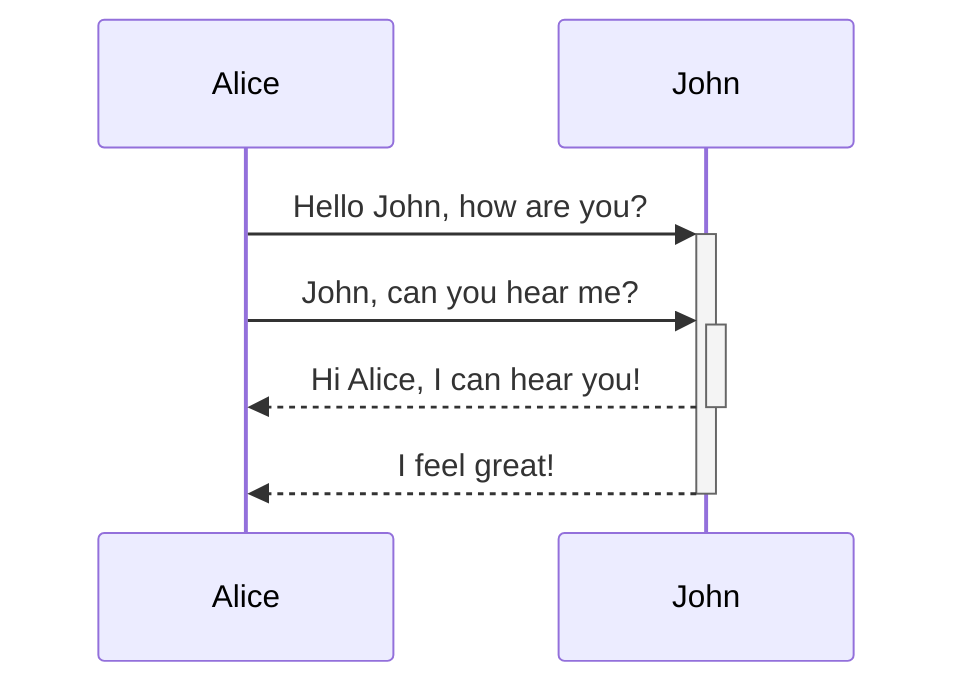
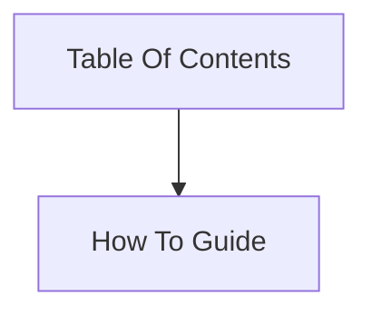

# Hello World
## Hello World
### Hello World

> Thats what they said

```
code here
```

List:
1) First
1) Second

[[Hello World|VM]]

[Obsidan Help](https://help.obsidian.md/How+to/Format+your+notes)


Task List:
- [x] Do  something
- [x] Do another thing
- [ ] This is an incomplete item

Table

First Header | Second Header
------------ | ------------
Content from cell 1 | Content from cell 2
Content in the first column | Content in the second column

Highlight Text:

==This is highlighted==

Diagram:





Tags
#how_to_guide

