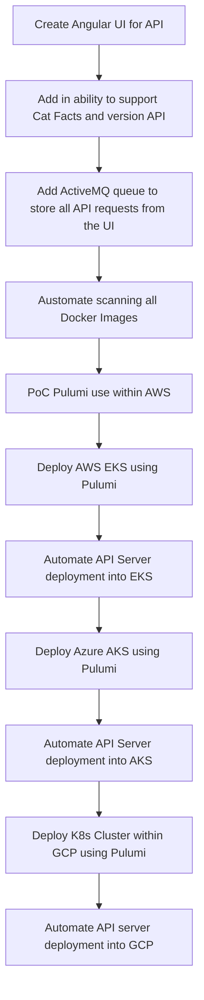

# Roadmap

```mermaid
graph TD

Angular_App[Create Angular UI for API]
API_Versioning[Add in ability to support Cat Facts and version API]
ActiveMQ_Queue[Add ActiveMQ queue to store all API requests from the UI]
Security_Scanning[Austomate scanning all Docker Images]
Pulumi[PoC Pulumi use within AWS]
Pulumi_EKS[Deploy AWS EKS using Pulumi]
Docker_EKS[Automate API Server deployment into EKS]
Pulumi_AKS[Deploy Azure AKS using Pulumi]
Docker_AKS[Automate API Server deployment into AKS]
Pulumi_GCP[Deploy K8s Cluster within GCP using Pulumi]
Docker_GCP[Automate API server deployment into GCP]

Angular_App --> API_Versioning
API_Versioning --> ActiveMQ_Queue
ActiveMQ_Queue --> Security_Scanning
Security_Scanning --> Pulumi
Pulumi --> Pulumi_EKS
Pulumi_EKS --> Docker_EKS
Docker_EKS --> Pulumi_AKS
Pulumi_AKS --> Docker_AKS
Docker_AKS --> Pulumi_GCP
Pulumi_GCP --> Docker_GCP

class Angular_App,API_Versioning,ActiveMQ_Queue,Security_Scanning,Pulumi,Pulumi_EKS,Docker_EKS,Pulumi_AKS,Docker_AKS,Pulumi_GCP,Docker_GCP internal-link;
```