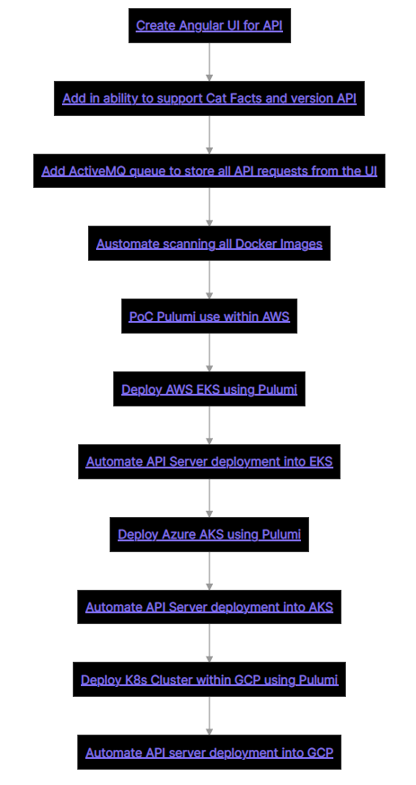

# Obsidian_Notes
This repo was designed to keep track of all work related to the side project which is currently being worked on. 

It uses a tool called "Obsidian" which is a free note taking software bundle that uses custom markdown that can be found here: 

Offical Docs: https://obsidian.md/ 

## Usage
Download and install the "Obsidian" tool from the offical website, and then select the "Notes" directory as the "Obsidian Vault" location. 

This should automatically load all of the markdown files that exist within the repo. 
All of the actual Roadmap + Side Project Notes are located within, alongside a "How To Guide" on how to use "Obsidian". 

"Obsidian" can also be used to make diagrams via "Mermaid" technology, as well as give the user the abiity to export any of the notes into PDF format. 

## Side Project Roadmap
